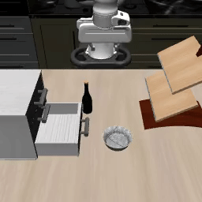
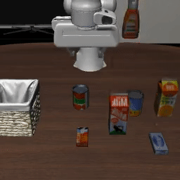
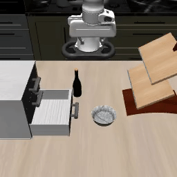

# Dual-System VLA on LIBERO-10

A dual-process architecture for robot manipulation that pairs a fast frozen policy (System 1: π0) with a slow vision-language reasoner (System 2: Qwen2.5-VL) on the LIBERO-10 benchmark. The contribution is a rigorous ablation study that localizes where and why text-conditioned sub-goal injection fails or helps.

**Key finding:** the S1–S2 text interface is the dominant bottleneck, not S2 reasoning quality. A destructive control (random sub-goals → 0%) proves the instruction channel is causally potent; an oracle control (perfect sub-goals ≈ baseline) proves it is saturated. See `report/report.pdf` for the full analysis.

---

## Architecture

```
┌─────────────────────────────────────────────────────┐
│                   DUAL-SYSTEM VLA                   │
│                                                     │
│  ┌─────────────────┐    text sub-goal    ┌────────┐ │
│  │  System 2 (S2)  │ ─────────────────► │  S1    │ │
│  │  Qwen2.5-VL-3B  │   ~1 Hz, async     │  π0    │ │
│  │  (frozen, bf16) │                    │  4B    │ │
│  │  visual → text  │                    │  25 Hz │ │
│  └────────┬────────┘                    └───┬────┘ │
│           │  RGB frame                      │      │
│           └──────────────┬──────────────────┘      │
│                          │ robot action             │
│                     LIBERO-10 env                   │
└─────────────────────────────────────────────────────┘
```

- **System 1:** `lerobot/pi0_libero_finetuned` — 4B flow-matching policy, runs at 25 Hz, frozen
- **System 2:** `Qwen/Qwen2.5-VL-3B-Instruct` — generates text sub-goals from RGB observations, runs ~1 Hz in a background thread
- **Interface:** S2 sub-goal appended to the original task instruction before π0's language encoder

---

## Rollout Demos

| A0 — no S2 (41.0%) | A1 — dynamic S2 (40.0%) | A1 — task 3 (70.0%) |
|:---:|:---:|:---:|
|  |  |  |
| Task 3: put bowl in drawer | Task 0: put soup + sauce in basket | Task 3: put bowl in drawer |

Full rollout videos (50 ep × 10 tasks × 6 conditions = 3,000 mp4 files) available on request.

---

## Results

| Condition | Config | Success Rate | vs A0 |
|-----------|--------|:---:|:---:|
| **A0** — no S2 (baseline) | original task instruction only | **41.0%** | — |
| **A1** — dynamic S2 @ 1 Hz | sub-goal appended every 45 steps | **40.0%** | −1.0 pp (ns) |
| **A2** — S2 frozen at t=0 | sub-goal set once, never updated | **41.0%** | 0.0 pp (ns) |
| **A3** — random sub-goals | shuffled instructions from other tasks | **0.0%** | −41.0 pp ★ |
| **A4** — oracle sub-goals | rule-based deterministic decomposition | **39.8%** | −1.2 pp (ns) |
| **A5** — temporal memory | VLM-gated with action/obs history | **37.2%** | −3.8 pp (ns) |

500 episodes per condition (50 per task × 10 tasks). ★ p ≪ 0.001. ns = not significant (95% CI ±4.3 pp at n=500).

Per-task breakdown and perturbation analysis in `report/report.pdf`.

---

## Setup

### Option A: Docker (recommended for exact reproduction)

```bash
cd docker/
docker compose up --build
# Opens SSH on port 2222; connect and run eval commands inside
```

Requirements: NVIDIA GPU with ≥ 16 GB VRAM (A4000 and A100 tested), CUDA 12.4, Docker with nvidia-container-toolkit.

### Option B: Conda environment

```bash
conda create -n dualvla python=3.10 -y
conda activate dualvla

# PyTorch (adjust CUDA version as needed)
pip install torch==2.4.0 torchvision==0.19.0 --index-url https://download.pytorch.org/whl/cu124

# LeRobot with LIBERO
pip install "lerobot[libero]"

# Patched transformers for pi0 compatibility (required)
pip install "git+https://github.com/huggingface/transformers.git@fix/lerobot_openpi"

# Qwen2.5-VL and utilities
pip install qwen-vl-utils accelerate huggingface_hub einops tqdm bitsandbytes

# Flash-Attention 2 (strongly recommended for S2 latency; requires CUDA headers)
pip install flash-attn --no-build-isolation
```

### Dataset

The evaluation uses `lerobot/libero_10` from the HuggingFace Hub. LeRobot downloads it automatically on first run. To pre-download:

```bash
python -c "from lerobot.common.datasets.lerobot_dataset import LeRobotDataset; LeRobotDataset('lerobot/libero_10')"
```

---

## Running the Evaluation

All ablations are controlled via environment variables. The policy is always `lerobot/pi0_libero_finetuned`.

### Quick sanity check (5 episodes, A1)

```bash
DUAL_ABLATION=a1 MUJOCO_GL=egl \
python -m src.eval.lerobot_eval_dual \
    --policy.path=lerobot/pi0_libero_finetuned \
    --env.type=libero --env.task=libero_10 \
    --eval.n_episodes=5 --eval.batch_size=1 \
    --output_dir=./outputs/a1_sanity
```

### Full ablation study (50 episodes per task = 500 total)

```bash
# A0 — baseline, no S2
DUAL_ABLATION=a0 MUJOCO_GL=egl \
python -m src.eval.lerobot_eval_dual \
    --policy.path=lerobot/pi0_libero_finetuned \
    --env.type=libero --env.task=libero_10 \
    --eval.n_episodes=50 --eval.batch_size=1 \
    --output_dir=./outputs/a0_baseline

# A1 — dynamic S2 @ 1 Hz (append mode)
DUAL_ABLATION=a1 MUJOCO_GL=egl \
python -m src.eval.lerobot_eval_dual \
    --policy.path=lerobot/pi0_libero_finetuned \
    --env.type=libero --env.task=libero_10 \
    --eval.n_episodes=50 --eval.batch_size=1 \
    --output_dir=./outputs/a1_dynamic

# A2 — S2 frozen after first frame
DUAL_ABLATION=a2 MUJOCO_GL=egl \
python -m src.eval.lerobot_eval_dual \
    --policy.path=lerobot/pi0_libero_finetuned \
    --env.type=libero --env.task=libero_10 \
    --eval.n_episodes=50 --eval.batch_size=1 \
    --output_dir=./outputs/a2_frozen

# A3 — random sub-goals (destructive control)
DUAL_ABLATION=a3 MUJOCO_GL=egl \
python -m src.eval.lerobot_eval_dual \
    --policy.path=lerobot/pi0_libero_finetuned \
    --env.type=libero --env.task=libero_10 \
    --eval.n_episodes=50 --eval.batch_size=1 \
    --output_dir=./outputs/a3_random

# A4 — oracle sub-goals (rule-based upper bound)
DUAL_ABLATION=a4 MUJOCO_GL=egl \
python -m src.eval.lerobot_eval_dual \
    --policy.path=lerobot/pi0_libero_finetuned \
    --env.type=libero --env.task=libero_10 \
    --eval.n_episodes=50 --eval.batch_size=1 \
    --output_dir=./outputs/a4_oracle

# A5 — temporal memory / VLM-gated replanning
DUAL_ABLATION=a5 MUJOCO_GL=egl \
python -m src.eval.lerobot_eval_dual \
    --policy.path=lerobot/pi0_libero_finetuned \
    --env.type=libero --env.task=libero_10 \
    --eval.n_episodes=50 --eval.batch_size=1 \
    --output_dir=./outputs/a5_temporal
```

### Environment variable reference

| Variable | Values | Default | Description |
|----------|--------|---------|-------------|
| `DUAL_ABLATION` | `a0`\|`a1`\|`a2`\|`a3`\|`a4`\|`a5` | `a1` | Ablation condition |
| `DUAL_N_TRIGGER` | int | `45` | Steps between S2 calls |
| `DUAL_S2_MODE` | `append`\|`replace` | `append` | How sub-goal joins task instruction |
| `DUAL_S2_MODEL` | HF model id | `Qwen/Qwen2.5-VL-3B-Instruct` | S2 backbone |
| `DUAL_LOG_DIR` | path | `s2_logs` | Directory for S2 call logs |
| `DUAL_PERTURB_STEP` | int | `-1` | Step to teleport object (−1 = off) |
| `DUAL_NOISE_SEED` | int | (unset) | Reseed torch RNG for noise-floor control |

### Error-recovery perturbation (2×2 protocol)

```bash
# Perturbed A0 (object teleported 5 cm at step 50)
DUAL_ABLATION=a0 DUAL_PERTURB_STEP=50 MUJOCO_GL=egl \
python -m src.eval.lerobot_eval_dual \
    --policy.path=lerobot/pi0_libero_finetuned \
    --env.type=libero --env.task=libero_10 \
    --eval.n_episodes=30 --eval.batch_size=1 \
    --output_dir=./outputs/perturb_a0

# Perturbed A1
DUAL_ABLATION=a1 DUAL_PERTURB_STEP=50 MUJOCO_GL=egl \
python -m src.eval.lerobot_eval_dual \
    --policy.path=lerobot/pi0_libero_finetuned \
    --env.type=libero --env.task=libero_10 \
    --eval.n_episodes=30 --eval.batch_size=1 \
    --output_dir=./outputs/perturb_a1
```

---

## Bottleneck Analysis

After running A0 and A1, classify A1 failures into bottleneck categories:

```bash
python -m src.eval.failure_classifier \
    --a0_dir ./outputs/a0_baseline \
    --a1_dir ./outputs/a1_dynamic \
    --a4_dir ./outputs/a4_oracle \
    --output failure_partition.json
```

Failure categories (from the paper's same-seed cross-conditioning):

| Category | Definition | Share |
|----------|-----------|:-----:|
| F-Shared | Fails under A0, A1, and A4 — S1 execution ceiling | 45.3% |
| F-Interface | A0 ok, A4 fails — append-suffix format penalty | 19.0% |
| F-Content | A0 fails, A4 ok — S2 content shortfall | 19.0% |
| F-Dynamic | Only A1 fails — mid-episode sub-goal churn | 16.7% |

---

## Noise-Floor Control

Verify that A0 vs A1 disagreement is within the same-condition sampling-noise floor:

```bash
# Run A1 twice with different torch seeds, same env seed
DUAL_ABLATION=a1 DUAL_NOISE_SEED=1 MUJOCO_GL=egl \
python -m src.eval.lerobot_eval_dual ... --output_dir=./outputs/a1_noise

python -m src.eval.noisefloor_diff \
    --base_dir ./outputs/a1_dynamic \
    --noise_dir ./outputs/a1_noise
```

Expected: flip rate ≈ 39%, SR difference ≈ 0–1 pp, McNemar p > 0.5.

---

## Repository Structure

```
dual-system-vla-libero/
├── src/
│   ├── eval/
│   │   ├── lerobot_eval_dual.py     # Main evaluation script (all ablations)
│   │   ├── failure_classifier.py    # Post-hoc bottleneck classification
│   │   ├── noisefloor_diff.py       # Same-condition noise-floor control
│   │   └── perturbation.py          # Error-recovery 2×2 eval
│   └── system2/
│       ├── planner.py               # Qwen2.5-VL-3B sub-goal generator (A1/A2/A3)
│       ├── planner_v2.py            # Completion-gated variant (A5)
│       ├── prompts.py               # Sub-goal generation prompts
│       ├── prompts_v2.py            # A5 completion-detection prompts
│       ├── oracle.py                # Rule-based oracle (A4)
│       ├── async_runner.py          # Background thread wrapper (A1/A2/A3/A4)
│       └── async_runner_v2.py       # Extended async runner (A5)
├── scripts/
│   └── generate_subgoal_dataset.py  # Pre-label LIBERO with oracle sub-goals
├── docker/                          # Dockerfile + compose for reproducible env
├── assets/                          # Rollout GIFs
└── report/
    └── report.pdf                   # 3-page research paper
```

---

## Hardware

All experiments ran on a single NVIDIA RTX A4000 16 GB GPU.

- S1 inference: 25 Hz (40 ms/step)
- S2 inference: ~1 Hz (674 ms mean, 751 ms P95 with FlashAttention-2)
- S2 runs in a background thread; S1 is never blocked

Total compute: ~42 GPU-hours across 3,000 evaluation episodes.
# dual-system-vla-libero
